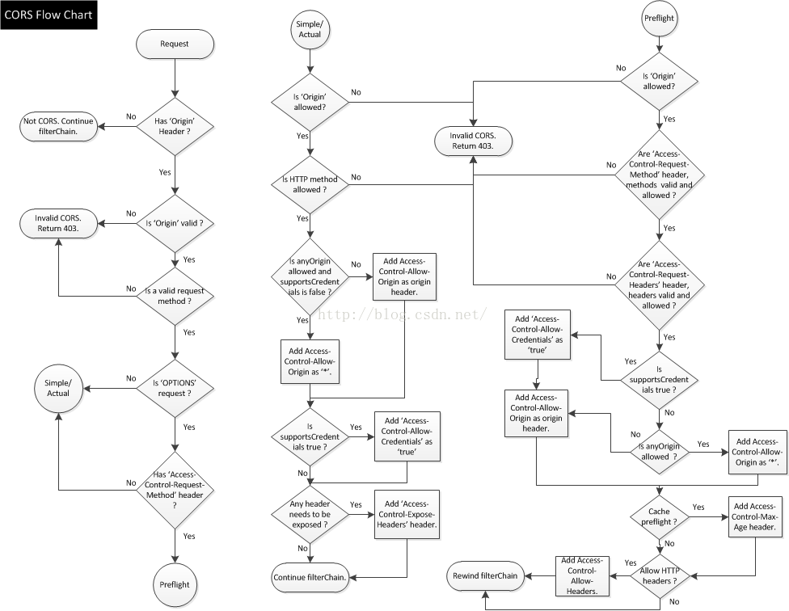

# 跨域配置处理
## 主要配置
修改文件：WWW\wordpress\wp-includes\rest-api.php
将文件中函数rest_send_cors_headers对Access-Control-Allow-Origin的配置重新赋值，
``` php
/**
 * Sends Cross-Origin Resource Sharing headers with API requests.
 *
 * @since 4.4.0
 *
 * @param mixed $value Response data.
 * @return mixed Response data.
 */
function rest_send_cors_headers( $value ) {
	$origin = get_http_origin();

	if ( $origin ) {
		// Requests from file:// and data: URLs send "Origin: null".
		if ( 'null' !== $origin ) {
			$origin = esc_url_raw( $origin );
		}
        // 放开限制
		header( 'Access-Control-Allow-Origin: ' . '*' );
		header( 'Access-Control-Allow-Methods: OPTIONS, GET, POST, PUT, PATCH, DELETE' );
		header( 'Access-Control-Allow-Credentials: true' );
        // 添加响应头类型
		header( 'Access-Control-Allow-Headers: Authorization, X-Requested-With, X-WP-Nonce, Content-Type' );
		header( 'Vary: Origin', false );
	} elseif ( ! headers_sent() && 'GET' === $_SERVER['REQUEST_METHOD'] && ! is_user_logged_in() ) {
		header( 'Vary: Origin', false );
	}

	return $value;
}
```
在前端文件中添加对token的支持。

## 请求=>CORS


- 简单请求
  - GET 
  - HEAD 
  - POST Content-Type为text/plain、multipart、form-data、application/x-www-form-urlencoded
- 非简单请求
  - PUT 
  - DELETE 
  - CONNECT 
  - OPTIONS 
  - TRACE 
  - PATCH 
  - 人为设置了对 CORS 安全的首部字段集合之外的其他首部字段。该集合为： 
    - Accept 
    - Accept-Language 
    - Content-Language 
    - Content-Type 
    - DPR 
    - Downlink 
    - Save-Data 
    - Viewport-Width 
    - Width 
  - Content-Type的值不属于下列之一: 
    - application/x-www-form-urlencoded 
    - multipart/form-data 
    - text/plain
- 预检请求

## 事后
wordpress提供了一些cors插件，配置响应头仍然需要修改配置文件，不然会存在重复配置的问题。