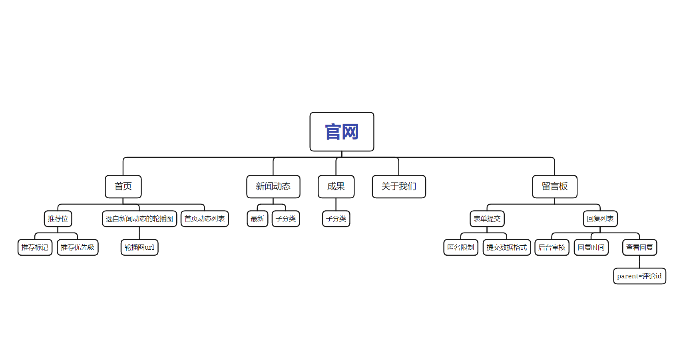
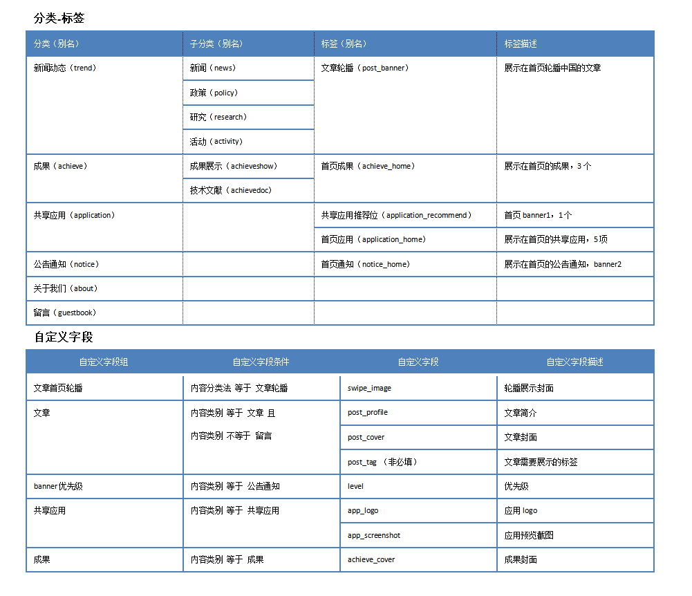

# 实现企业门户网站的整体思路
## 网站结构


## 概述
### 维护的内容基本都是文章
- 内容基本都是由标题、内容以及其他属性（分类，封面，是否展示在首页等）组成，可以通过父子分类和标签进行区分和标记，通过自定义字段增加属性
- 留言板也是借用文章作为载体(单独设置了留言的文章分类并创建一篇文章作为留言板，为cms添加过滤器允许游客通过API匿名评论)，每条留言都是一条评论，并且会使用评论自带的审批和回复功能。
## 分类、标签和自定义字段
- 分类只区分文章是什么文章，可以设置子分类细分，如公司动态和近期活动均在新闻动态模块下，可以视为新闻动态的子类。分类的别名作为代码中查询的唯一标记，务必与代码中的配置保持一致。
- 可以结合业务设置标签进行标记，例如标记某个分类中需要在特定位置展示的某几篇文章，也作为触发自定义字段的条件，勾选后即显示自定义字段的输入框，例如给新闻动态下的文章添加了文章轮播标签，会要求填写文章首页轮播字段组的内容。
- 自定义字段用于文章编辑阶段，补充除标题和内容之外的文案或图片，如简介、封面、预览图等，设置时尽量设置为必填，且位置为“高（标题之后）”方便编辑。如果是图片设置返回格式为“图像URL”



> 注
> - 自定义字段条件中内容类型为分类，内容类型法包括分类和标签等
> - 默认勾选必填

## 代码实现

### 1.配置slug字典
定义常量object，存储分类和标签的slug
``` javascript
// 文章分类
export const EnumPostSlug = {
    TREND: 'trend', // 新闻动态
    NEWS: 'news', // 新闻
    POLICY: 'policy', // 政策
    RESEARCH: 'research', // 研究
    ACTIVITY: 'activity', // 活动
    ACHIEVEMENT: 'achieve', // 成果
    ACHIEVEMENT_SHOW: 'achieveshow', // 成果展示
    ACHIEVEMENT_DOC: 'achievedoc', // 技术文献
    APPLICATION: 'application', // 共享应用
    NOTICE: 'notice', // 公告通知 banner2
    ABOUT: 'about', // 关于我们
    GUESTBOOK: 'guestbook', // 留言板
}
// 文章标签
export const EnumPostTag = {
    POST_BANNER: 'post_banner', // 轮播的文章
    ACHIEVEMENT_HOME: 'achieve_home', // 首页成果
    APPLICATION_HOME: 'application_home', // 共享应用首页展示
    APPLICATION_RECOMMEND: 'application_recommend', // 共享应用推荐位
    NOTICE_HOME: 'notice_home', // 首页通知
}
```
### 2.查找对应文章
2.1 请求数据时先全量获取分类(/wp/v2/categories)，方便起见设置每页返回参数per_page的值为99。

2.2 根据子分类或标签确认查询文章的目标范围